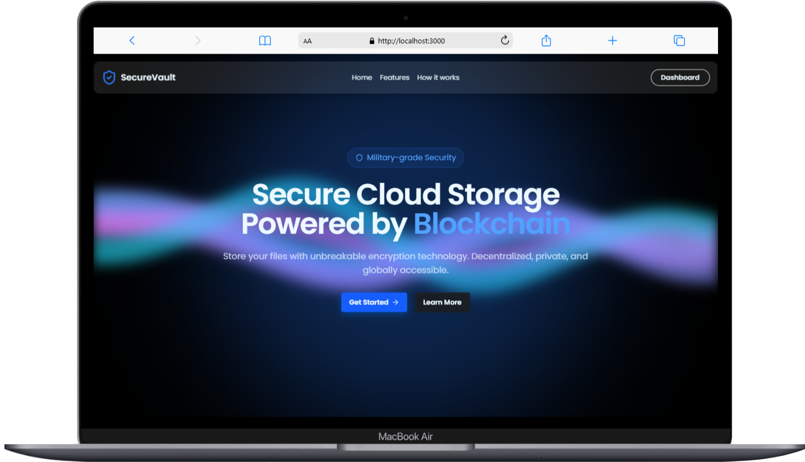
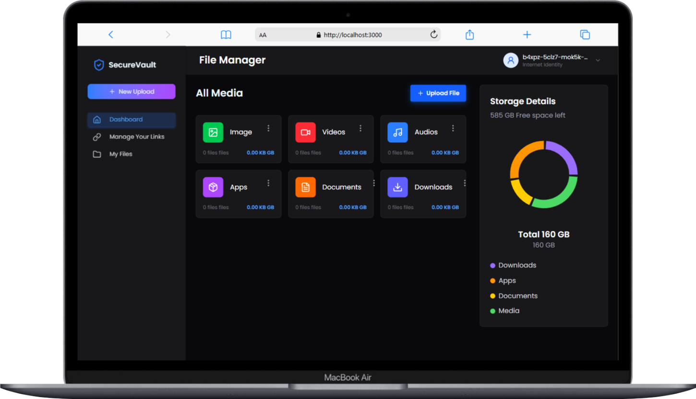

# `SecureVault 🚀🔗 `

---

### **Welcome to SecureVault** 🚀🔗  
**SecureVault** is a secure, decentralized, and permanent blockchain-based storage solution. Built on the **Internet Computer (IC)**, SecureVault allows users to store, access, and share files without relying on centralized servers.  

---

### **✨ Key Features**  
✅ **Fully Decentralized** – Files are stored in **canister smart contracts**, ensuring security and transparency.  
✅ **Blockchain Security** – Data cannot be manipulated or deleted without proper authorization.  
✅ **Global Access** – Files are accessible anytime, anywhere, without reliance on traditional servers.  
✅ **Transparent Costs** – Unlike traditional cloud storage, blockchain-based storage has predictable fees.  
✅ **Privacy & Encryption** – Data can be encrypted before upload to ensure privacy.  
✅ **Compression Support** – Files are compressed before storage to optimize on-chain space.  

---

### **🚀 How SecureVault Works**  
1️⃣ **Upload File** – Users upload files through the SecureVault interface.  
2️⃣ **Compression & Encryption** – Files are compressed and optionally encrypted before storage.  
3️⃣ **On-Chain Storage** – Files are stored on the blockchain using canister smart contracts.  
4️⃣ **Access via Hash** – Users receive a **unique hash** to retrieve their files anytime.  
5️⃣ **Download & Decompression** – Files can be downloaded and decrypted when needed.  

---

### **💰 Pricing Plans**  

#### **1️⃣ Shared Canister (Affordable & Efficient) 💾**  
For users who need **cost-effective storage**, files are stored in a shared canister, optimized for multiple users.  

✅ **Price:** ~$0.05 per GB/month  
✅ **Ideal for:** Personal storage, small projects, and general use  
✅ **Storage Limit:** Up to 2GB per user  
✅ **Performance:** Shared bandwidth and computational resources  

---

#### **2️⃣ Dedicated Canister (Premium & Scalable) 🔥**  
For users who need **exclusive storage** with higher performance and dedicated resources.  

✅ **Price:** ~$5 per GB/month (one-time cost for long-term storage)  
✅ **Ideal for:** Businesses, developers, and high-demand applications  
✅ **Storage Limit:** Up to 300GB per canister  
✅ **Performance:** Faster access, dedicated bandwidth, and computational resources  

**💡 Note:** Costs may vary based on network cycles usage. Prices are based on ICP token conversion rates.  

---

### **🚀 Start Using SecureVault Today!**  
Join the decentralized storage revolution and manage your files with the highest level of security! 🔥  

---

Would you like any modifications, or do you need an estimation tool for calculating storage costs based on ICP prices? 😊

_____________________________________________________________________

👥 Credits

Developed by the Wedang Uwuh Team

Alfarizi – Putera – Raha 
______________________________________________________________________

